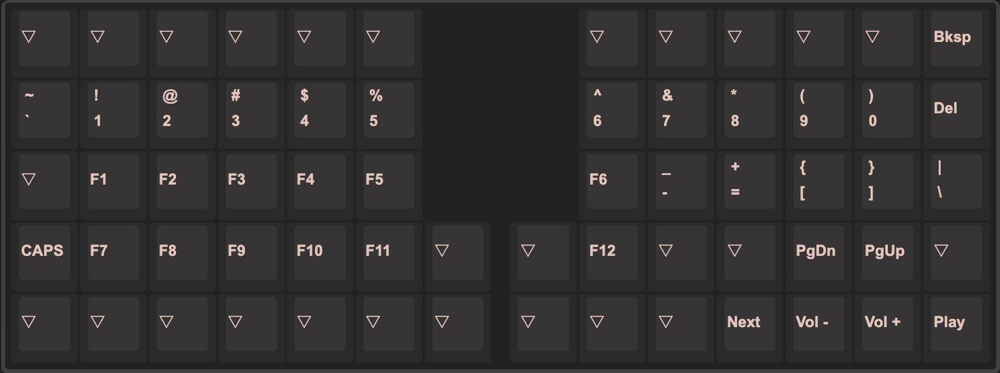

## Helix Keymap

自作キーボード、[Helix LP Rev3](https://shop.yushakobo.jp/products/2143)のキーマップになります。

### QWERTYレイヤー

### RAISEレイヤー

### LOWERレイヤー

### ADJUSTレイヤー

## 参考

- [MakotoKurauchi/helix: A compact split ortholinear keyboard.](https://github.com/MakotoKurauchi/helix)
